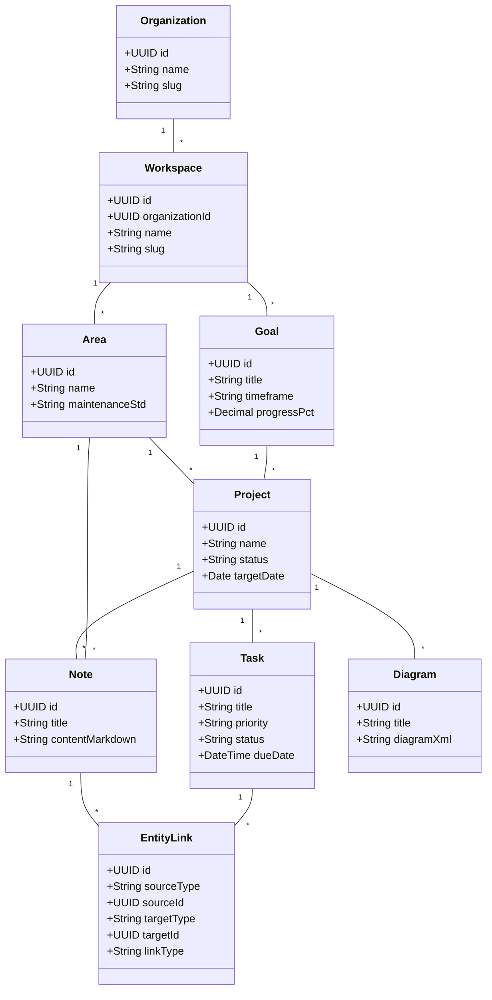

# 🧬 Domain Model Specification — Life OS

**Document Version:** 1.2.0  
**Status:** Approved  
**DDD Pattern:** Bounded Contexts, Aggregate Roots, Entities, Value Objects, Domain Events  
**Organizational Structure:** PARA Framework (Projects, Areas, Resources, Archives)  

---

## 1. Executive Summary & Domain Architecture Directives

### 1.1 Purpose
This document provides the comprehensive **Domain-Driven Design (DDD) Model** for **Life OS**. It establishes the Bounded Contexts, Aggregate Roots, Domain Entities, Value Objects, State Invariants, and Domain Event specifications across the entire system.

### 1.2 Core Domain Directives
1. **Multi-Tenant Scoping Invariant:** Every Aggregate Root MUST maintain strict `organization_id` and `workspace_id` tenant boundaries. Cross-workspace entity operations are forbidden.
2. **PARA Framework Taxonomy:** All domain execution and knowledge entities are explicitly categorized under PARA:
   - **Projects (P):** Short-term outcomes with deadlines (`Goal`, `Project`, `Milestone`, `Task`, `InboxItem`).
   - **Areas (A):** Continuous standards of responsibility with no end date (`Area`, `Habit`, `MetricTracker`, `FinanceAccount`).
   - **Resources (R):** Ongoing knowledge, assets, and topic references (`Note`, `Diagram`, `Document`, `WebClip`).
   - **Archives (A):** Frozen historical entities (`ArchiveItem`).
3. **The Life Graph (Universal Relationship Topology):** The system connects entities across Bounded Contexts via bidirectional `EntityLink` relationship edges, forming a unified knowledge and execution graph.

---

## 2. Bounded Context Map & Domain Topology



---

## 3. Detailed Bounded Context Specifications

---

### Context 1: Multi-Tenancy & Identity Context

Responsible for organization provisioning, workspace isolation, user identity, single sign-on (SSO), multi-factor authentication (MFA), and session management.

#### 1. Aggregate Roots & Entities
- **`Organization` (Aggregate Root):** Top-level tenant container.
- **`Workspace` (Aggregate Root):** Isolated environment scoping all user data, projects, notes, and chats.
- **`User` (Entity):** Identity profile belonging to an organization.
  - *Attributes:* `id`, `organization_id`, `email`, `password_hash`, `full_name`, `avatar_url`, `role` (`owner`, `admin`, `member`, `guest`), `mfa_enabled`, `mfa_secret`.
  - *Invariants:* Email must be globally unique per organization.
- **`UserSession` (Entity):** Active authenticated device session.
  - *Attributes:* `id`, `user_id`, `client_type` (`web`, `android`, `macos`, `windows`), `device_name`, `ip_address`, `token_hash`, `expires_at`.
- **`AuthProvider` (Entity):** SSO integration configuration (OIDC, SAML 2.0, OAuth2).

#### 2. Value Objects
- `UserRole`: Enum (`OWNER`, `ADMIN`, `MEMBER`, `GUEST`).
- `ClientType`: Enum (`WEB`, `ANDROID`, `MACOS`, `WINDOWS`).
- `MFAConfig`: Value object holding TOTP secret and WebAuthn credentials.

#### 3. Domain Events
- `UserRegisteredEvent` (`user_id`, `organization_id`, `timestamp`)
- `UserAuthenticatedEvent` (`user_id`, `session_id`, `client_type`, `ip_address`)
- `SessionRevokedEvent` (`session_id`, `user_id`, `reason`)

---

### Context 2: PARA Projects & Execution Context (P)

Manages actionable execution items, strategic alignment, project lifecycle, and task execution.

#### 1. Aggregate Roots & Entities
- **`InboxItem` (Aggregate Root):** Raw captured input awaiting triage.
  - *Attributes:* `id`, `workspace_id`, `content`, `source` (`quick_capture`, `email`, `web_clip`, `android_share`), `is_triaged`, `triaged_to_type`, `triaged_to_id`.
  - *State Transitions:* `Untriaged` $\rightarrow$ `Triaged` (routed to Task, Note, Project, Area, or Archive).
- **`Goal` (Aggregate Root):** High-level strategic objective.
  - *Attributes:* `id`, `workspace_id`, `area_id`, `parent_goal_id`, `title`, `description`, `timeframe` (`long_term`, `yearly`, `quarterly`), `target_date`, `progress_pct`, `status`.
- **`Project` (Aggregate Root):** Outcome-oriented container with a target deadline.
  - *Attributes:* `id`, `workspace_id`, `goal_id`, `area_id`, `name`, `objective`, `status` (`planning`, `active`, `paused`, `completed`, `archived`), `start_date`, `target_date`, `completed_at`.
  - *Invariants:* When status transitions to `completed`, system automatically triggers auto-archival proposal.
- **`Milestone` (Entity):** Intermediate project target date grouping tasks.
- **`Task` (Aggregate Root):** Individual actionable task item.
  - *Attributes:* `id`, `workspace_id`, `project_id`, `milestone_id`, `area_id`, `assigned_to`, `title`, `description`, `status`, `priority`, `start_date`, `due_date`, `estimated_hours`, `recurrence_rule`, `completed_at`.
  - *State Transitions:* `Backlog` $\rightarrow$ `To Do` $\rightarrow$ `In Progress` $\rightarrow$ `Waiting` $\rightarrow$ `Done`.

#### 2. Value Objects
- `TaskPriority`: Enum (`URGENT`, `HIGH`, `MEDIUM`, `LOW`).
- `TaskStatus`: Enum (`BACKLOG`, `TO_DO`, `IN_PROGRESS`, `WAITING`, `DONE`).
- `ProjectStatus`: Enum (`PLANNING`, `ACTIVE`, `PAUSED`, `COMPLETED`, `ARCHIVED`).
- `RecurrenceRule`: iCalendar RRULE value object for recurring task calculations.

#### 3. Domain Events
- `InboxItemCapturedEvent` (`inbox_item_id`, `source`, `workspace_id`)
- `InboxItemTriagedEvent` (`inbox_item_id`, `target_type`, `target_id`)
- `TaskCreatedEvent` (`task_id`, `project_id`, `workspace_id`)
- `TaskCompletedEvent` (`task_id`, `completed_by`, `completed_at`)
- `ProjectCompletedEvent` (`project_id`, `workspace_id`, `completion_date`)

---

### Context 3: PARA Areas & Responsibility Context (A)

Manages continuous life spheres, maintenance standards, habits, quantitative metrics, and personal finance ledgers.

#### 1. Aggregate Roots & Entities
- **`Area` (Aggregate Root):** Permanent sphere of responsibility (e.g., Health, Finance, Career, Homelab).
  - *Attributes:* `id`, `workspace_id`, `name`, `description`, `color_code`, `icon`, `maintenance_std`, `is_active`.
- **`Habit` (Aggregate Root):** Repeated action designed to maintain an Area standard.
  - *Attributes:* `id`, `workspace_id`, `area_id`, `name`, `frequency` (`daily`, `weekly`, `monthly`), `target_count`, `current_streak`, `best_streak`.
- **`HabitLog` (Entity):** Historical log of habit completion.
- **`MetricTracker` (Aggregate Root):** Quantitative metric tracker.
  - *Attributes:* `id`, `workspace_id`, `area_id`, `name`, `unit` (`hours`, `kg`, `$`, `count`, `boolean`), `target_value`.
- **`MetricEntry` (Entity):** Logged numerical data point.
- **`FinanceAccount` (Aggregate Root):** Financial account ledger (Checking, Savings, Credit, Investment).
  - *Attributes:* `id`, `workspace_id`, `area_id`, `name`, `account_type`, `balance`, `currency`.
- **`Transaction` (Entity):** Individual financial ledger record (Income, Expense, Transfer).

#### 2. Value Objects
- `HabitFrequency`: Enum (`DAILY`, `WEEKLY`, `MONTHLY`).
- `MetricUnit`: Enum (`HOURS`, `KG`, `CURRENCY`, `COUNT`, `BOOLEAN`).
- `TransactionType`: Enum (`INCOME`, `EXPENSE`, `TRANSFER`).

#### 3. Domain Events
- `HabitCompletedEvent` (`habit_id`, `log_date`, `current_streak`)
- `MetricLoggedEvent` (`tracker_id`, `value`, `entry_date`)
- `TransactionRecordedEvent` (`account_id`, `amount`, `transaction_type`, `category`)

---

### Context 4: PARA Resources & Knowledge Context (R)

Manages second-brain knowledge notes, visual whiteboard diagrams, digital document vaults, and web clips.

#### 1. Aggregate Roots & Entities
- **`Note` (Aggregate Root):** Second Brain markdown & rich-text note.
  - *Attributes:* `id`, `workspace_id`, `area_id`, `project_id`, `title`, `content_markdown`, `content_html`, `is_pinned`.
  - *Invariants:* Must support `[[Wiki-links]]` parsing and automatic bidirectional backlink registration.
- **`Diagram` (Aggregate Root):** Visual draw.io XML canvas document.
  - *Attributes:* `id`, `workspace_id`, `project_id`, `area_id`, `title`, `diagram_xml`, `preview_png_url`.
- **`Document` (Aggregate Root):** Vault asset file (PDF, receipt, image).
  - *Attributes:* `id`, `workspace_id`, `project_id`, `area_id`, `file_name`, `file_size_bytes`, `mime_type`, `storage_path`, `ocr_text`.
- **`WikiLink` (Value Object / Entity):** Extracted inline reference (`[[Target Note Title]]`).

#### 2. Domain Events
- `NoteCreatedEvent` (`note_id`, `workspace_id`, `title`)
- `WikiLinkExtractedEvent` (`source_note_id`, `target_note_title`)
- `DiagramSavedEvent` (`diagram_id`, `project_id`, `workspace_id`)
- `DocumentUploadedEvent` (`document_id`, `file_name`, `storage_path`)

---

### Context 5: Communications & Calendar Context

Manages real-time messaging, channels, direct messages, calendar events, and time-blocking.

#### 1. Aggregate Roots & Entities
- **`Conversation` (Aggregate Root):** Chat channel or direct message thread.
  - *Attributes:* `id`, `workspace_id`, `name`, `is_channel`, `is_private`.
- **`Message` (Entity):** Individual chat message.
  - *Attributes:* `id`, `conversation_id`, `sender_id`, `parent_message_id`, `body`, `attachments`.
  - *Invariants:* Can be converted directly into Task (P), Note (R), or Reminder (A).
- **`CalendarEvent` (Aggregate Root):** Scheduled time block or event.
  - *Attributes:* `id`, `workspace_id`, `task_id`, `title`, `start_time`, `end_time`, `is_all_day`, `location`.
- **`Reminder` (Aggregate Root):** Alert notification trigger.

#### 2. Domain Events
- `MessageSentEvent` (`message_id`, `conversation_id`, `sender_id`)
- `MessageConvertedToTaskEvent` (`message_id`, `task_id`, `created_by`)
- `TaskTimeBlockedEvent` (`task_id`, `event_id`, `start_time`, `end_time`)

---

### Context 6: Life Graph & Universal Relationships Context

Manages the polymorphic relationship edges connecting entities across all Bounded Contexts.

#### 1. Aggregate Roots & Entities
- **`EntityLink` (Aggregate Root):** Polymorphic directional edge table connecting any source entity to any target entity.
  - *Attributes:* `id`, `workspace_id`, `source_type` (`task`, `note`, `project`, `diagram`, `message`, `area`, `goal`), `source_id`, `target_type`, `target_id`, `link_type` (`references`, `child_of`, `converts_to`, `blocks`).
  - *Invariants:* Duplicate directional edges (`source_type`, `source_id`, `target_type`, `target_id`, `link_type`) within the same workspace are forbidden. Inverse relationships are dynamically navigable.

#### 2. Value Objects
- `EntityType`: Enum (`TASK`, `NOTE`, `PROJECT`, `DIAGRAM`, `MESSAGE`, `AREA`, `GOAL`, `DOCUMENT`, `EVENT`).
- `LinkType`: Enum (`REFERENCES`, `CHILD_OF`, `CONVERTS_TO`, `BLOCKS`, `DERIVED_FROM`).

#### 3. Domain Events
- `EntityLinkCreatedEvent` (`link_id`, `source_type`, `source_id`, `target_type`, `target_id`, `link_type`)
- `EntityLinkRemovedEvent` (`link_id`, `workspace_id`)

---

### Context 7: System Governance, Archival & Backup Context

Manages long-term archival, automated backup schedules, disaster recovery, and system audit logs.

#### 1. Aggregate Roots & Entities
- **`ArchiveItem` (Aggregate Root):** Registry of frozen historical assets.
  - *Attributes:* `id`, `workspace_id`, `entity_type`, `entity_id`, `archived_by`, `archived_at`, `archive_reason`, `restored_at`.
- **`BackupSnapshot` (Aggregate Root):** Encrypted backup snapshot metadata.
  - *Attributes:* `id`, `workspace_id`, `snapshot_type` (`hourly_delta`, `daily_full`, `manual`), `file_path`, `file_size_bytes`, `checksum_sha256`, `created_at`.
- **`AutomationRule` (Aggregate Root):** Rule definition (`WHEN trigger_event THEN action_handler`).

#### 2. Domain Events
- `EntityArchivedEvent` (`entity_type`, `entity_id`, `archived_by`)
- `BackupCreatedEvent` (`snapshot_id`, `snapshot_type`, `checksum_sha256`)
- `WorkspaceRestoredEvent` (`workspace_id`, `snapshot_id`, `restored_at`)

---

## 4. Domain Event Flow Matrix

```text
  [ User Action / System Trigger ]
                 │
                 ▼
     [ Aggregate Root Execution ]
                 │
                 ▼
       [ Emit Domain Event ] ──────────► [ Event Bus (Redis / PubSub) ]
                                                        │
         ┌──────────────────────┬───────────────────────┼──────────────────────┐
         ▼                      ▼                       ▼                      ▼
 [ Search Indexer Listener ] [ Context Inspector ] [ Notification Dispatch ] [ Audit Logger ]
 (Updates Full-Text/FTS)    (Updates Life Graph)   (WebPush/Mobile/macOS)  (Security Log)
```

---

## 5. Document Sign-Off & Verification

| Role | Verification Action | Status |
| :--- | :--- | :--- |
| **Domain Architect** | DDD Bounded Contexts, Aggregate Roots, & Invariants verified | Verified |
| **System Architect** | Alignment with [`product/vision.md`](file:///Users/ritikgarg/workspace/lifeos/product/vision.md) and [`architecture/data-model.md`](file:///Users/ritikgarg/workspace/lifeos/architecture/data-model.md) | Verified |
| **Security Lead** | Multi-tenant isolation invariants enforced across all Aggregate Roots | Verified |
